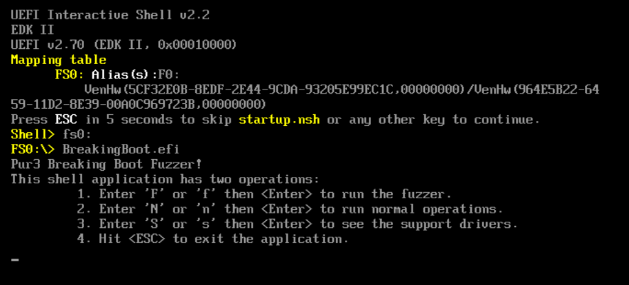
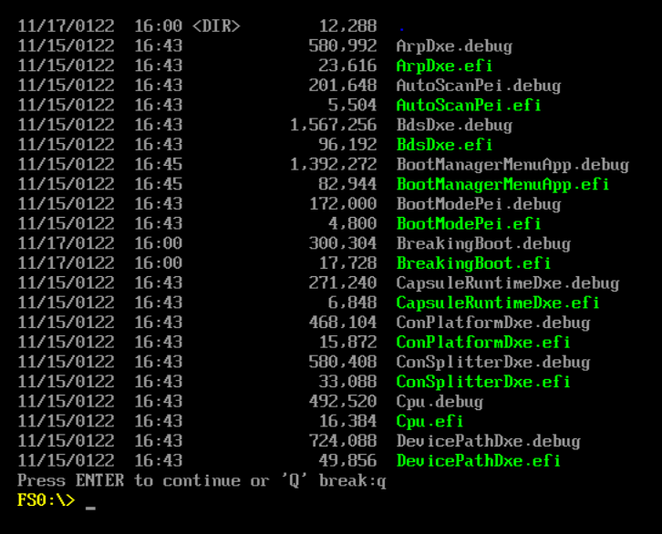

# BreakingBoot Fuzzing Application
This document will layout how to compile, execute, and limitations of the current application. The code was added ontop of the current `edk2` code in our own repo. The current code under development can be found [here](https://github.com/BreakingBoot/edk2/tree/breakingboot).

## About the Application
The application currently has 3 functions:
1. It can "fuzz" and driver on the system.
2. It can perform a normal operation on the system.
3. It can print the supported drivers.

## Compiling
This application was compiled following the instructions in the [Linux-Compilation](https://github.com/BreakingBoot/learning-edk2/blob/main/Compiling/Linux-Compiling.md) document.

## Executing 
Once the code is compiled, follow the [execution guide](https://github.com/BreakingBoot/learning-edk2/blob/main/Executing/QEMU-Emulation.md) to test the code, it can be tested using Simics as well. After you execute the emulator, use the following commands to execute it:
```
// This command is to enter filesystem 0
Shell> fs0:
// Now run the code
FS0:\> BreakingBoot.efi
This shell application has two operations:
        1. Enter 'F' or 'f' then <Enter> to run the fuzzer.
        2. Enter 'N' or 'n' then <Enter> to run normal operations.
        3. Enter 'S' or 's' then <Enter> to see the support drivers. 
        4. Hit <ESC> to exit the application.
```
Here should make it a little more clear to the output you will get:


Incase you run to run other applications or drivers, you can check to see if they are in the current file system with the following commands:
```
Shell> fs0:
FS0:\> ls -b
```

The `-b` is used to only show enough information that can fit on the screen because there is no scrolling capability in the shell window. Below should show what the output would look like, and you can see the `BreakingBoot.efi` application in the directory:



## Limitations
The current limitations for the BreakingBoot application are:
* It doesn't have memory protection when reading inputs (a set buffer size).
* It can't properly delete characters when reading in an driver string.
* It only has a hardcoded test driver being used instead of using the driver that is being read in.
